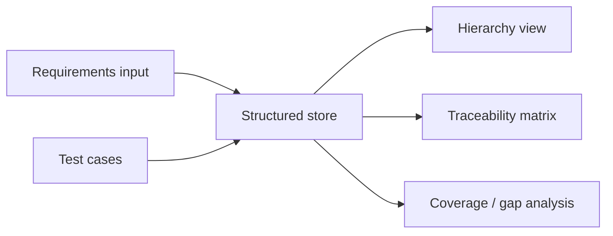

# Requirements Traceability Workbench

> A structured workbench for hierarchical software requirements, traceability, and verification coverage.

## What it does
This project helps define and maintain a requirements hierarchy, link requirements to test cases, and generate a traceability matrix for review and verification planning. It is intentionally lightweight, but the workflow mirrors the discipline used in requirements tools such as SE-Tool or System Weaver.

## Why I built it
I wanted a practical way to model requirements as structured, reviewable artifacts instead of ad hoc notes. The goal is to make requirement relationships, test coverage, and verification gaps visible in one place.

## Core capabilities
- System and software requirement hierarchy
- Parent-child requirement relationships
- Requirement versioning-ready data model
- Requirement-to-test traceability matrix
- Coverage summary and orphan detection
- Editable local store with simple exportable artifacts

## Architecture


## Tech stack
- Python
- Streamlit
- Standard library data structures
- pytest

## Quick start
```bash
pip install -r requirements.txt
streamlit run app/streamlit_app.py
```

## Example output
- Requirements table
- Test case table
- Traceability matrix
- Coverage percentage
- Orphan requirement list

## Limitations
- This is a portfolio workbench, not a full-scale requirements management platform.
- The data model is intentionally simple and local-first.
- It is designed to show structure and traceability discipline, not enterprise integrations.

## Testing
```bash
pytest
```

## Docker
```bash
docker compose up --build
```
